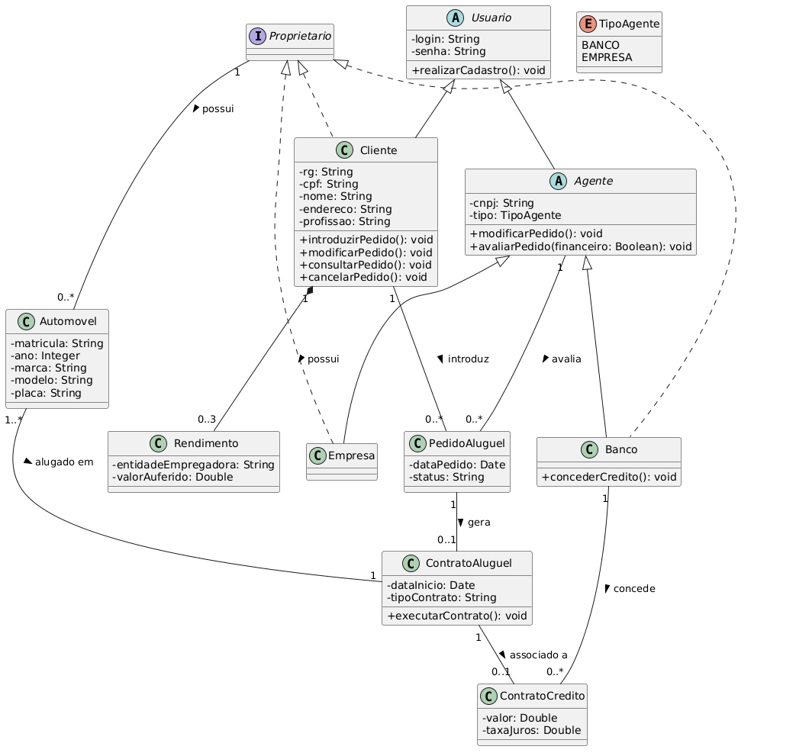

# Sistema de Aluguel de Carros
Trabalho acadêmico desenvolvido para a disciplina de **Laboratório de Desenvolvimento de Software** (4º Período) do curso de Engenharia de Software na **PUC Minas**. 

O projeto consiste em um sistema Web em **Java**, utilizando a arquitetura **MVC**, voltado para a gestão de aluguéis de automóveis, permitindo operações via Internet como efetuar, cancelar e modificar pedidos. O sistema é subdividido em dois subsistemas principais: um para gestão de pedidos e contratos, e outro para a construção dinâmica das páginas web.

## Histórias de Usuário (User Stories)

**UC01 - Cadastrar Usuário**
* Como um usuário, eu desejo me cadastrar previamente no sistema, para que eu possa acessar as funcionalidades da plataforma.

**UC02 - Gerenciar Pedido de Aluguel**
* Como um cliente, eu desejo introduzir, modificar, consultar e cancelar pedidos de aluguel, para gerenciar meus agendamentos de veículos.

**UC03 - Avaliar Pedido**
* Como um agente, eu desejo avaliar e modificar pedidos, para dar o parecer financeiro necessário para a execução do contrato.

**UC04 - Registrar Automóvel**
* Como um administrador, eu desejo registrar a matrícula, ano, marca, modelo e placa de um automóvel, para que ele esteja disponível para locação no sistema.

**UC05 - Vincular Contrato de Crédito**
* Como um banco agente, eu desejo associar um contrato de crédito a um aluguel, para formalizar o financiamento do automóvel quando necessário.

**UC06 - Consultar Dados do Contratante**
* Como um agente, eu desejo consultar o RG, CPF, Nome, Endereço, profissão e rendimentos do contratante, para realizar a análise de crédito.

## Diagramas

**Diagrama de Casos de Uso**
 
*Modelagem inicial das interações entre Clientes, Agentes e o Sistema*

### Diagrama de Classes
 
 
 

### Diagrama de Pacotes (Visão Lógica)
 

 

---
